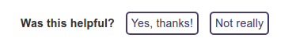

# GitBook Plugin for LotaData Feedback

This plugin for GitBook adds simple feedback buttons to all docs webpages. Feedback clicks get routed to Slack.

[](https://badge.fury.io/js/gitbook-plugin-lotadata-feedback)



## Configuration
Set your Slack channel and incoming webhook url.

```json
"page-feedback": {
    "slack-channel": "feedback",
    "slack-webhook": "https://hooks.slack.com/services/xyz/abc/123"
}
```


---

#### Questions?

We are eager to hear from you and happy to share best practices for integrating the SDK. There are many ways for you to reach us:
* Email [support@lotadata.com](mailto:support@lotadata.com)
* [Telegram @lotadata_sdk](http://t.me/lotadata_sdk)
* Slack developer community

But first, please [sign up for an account with LotaData](http://platform.lotadata.com/?signup=true) so that we may send you the link to download our SDK.

---


